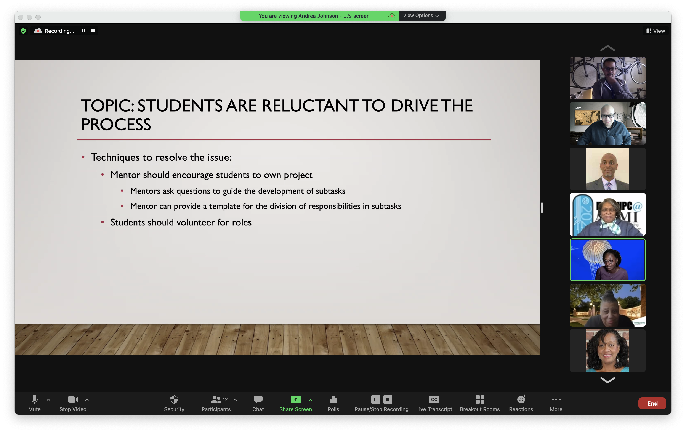

HackHPC's renowned "Mentor Training" pre-event took place on March 17th, 2022. The event was hosted by Veteran mentor [Charlie Dey](https://www.linkedin.com/in/charlie-dey-0031317a/) and Organizer [Je'aime Powell](https://www.linkedin.com/in/jeaimehp/). The highlight of the training session was the _"Mini-Hack"_ where the mentors created a 1-slide/1-minute presentation in seven (7) minutes to address a common issue that can occur in hackathon teams. The created slide is pictured below along with links to the training resources. 

>Training resources: [[Slide Deck]](../assets/../slides/Mentor%20Overview.pdf) | [[Video]](https://youtu.be/R0kcxZKj8AM) | [[Mini-Hack Slide]](../assets/images/MiniHack-slide.png)

