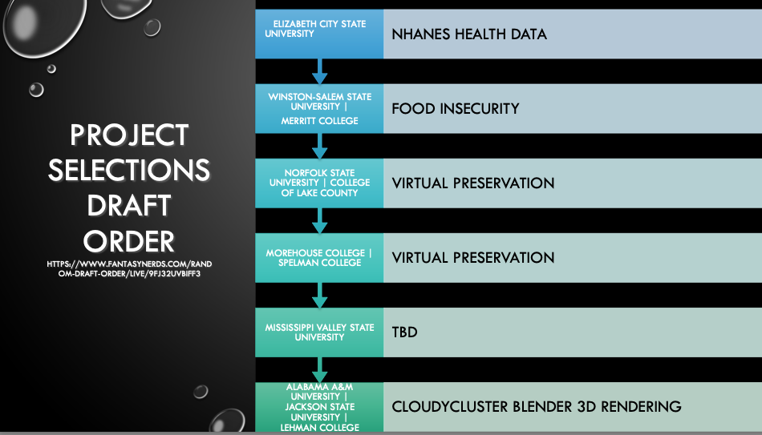
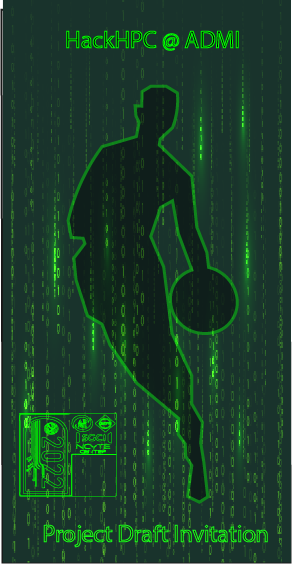

After an intense night, the Elizabeth City State University received the first overall selection in the 2022 HackHPC @ADMI draft.   With their first selection they selected the NHANES health data project, which was presented by Mr. Cole McKnight. The second selection was awarded to the team from Winston-Salem State University, which used this selection on Dr. Rebecca Caldwell’s Food Insecurity project.   The third (Norfolk State University and College of Lake County) and fourth (Morehouse College) picks both selected the project presented by Charlie Dey, the Virtual Preservation Society. The final pick in the draft was made by Jackson State University and Lehman College, which selected Boyd Wilson’s Cloudycluster Blender 3D rendering project.

>**Thank you to all of our Technical Mentors for their hard work and continued support of the HackHPC@ADMI hackathon!**

### Draft Selections

>Training resources: [[Kick-Off Slide Deck]](../slides/Kickoff.pdf) | [[The Draft Slide Deck]](../slides/Draft-Slides.pdf) | [[Video]](https://youtu.be/62oMiQGQpjw?t=3704) 

<iframe width="560" height="315" src="https://www.youtube.com/embed/62oMiQGQpjw?start=3704" title="YouTube video player" frameborder="0" allow="accelerometer; autoplay; clipboard-write; encrypted-media; gyroscope; picture-in-picture" allowfullscreen></iframe>

